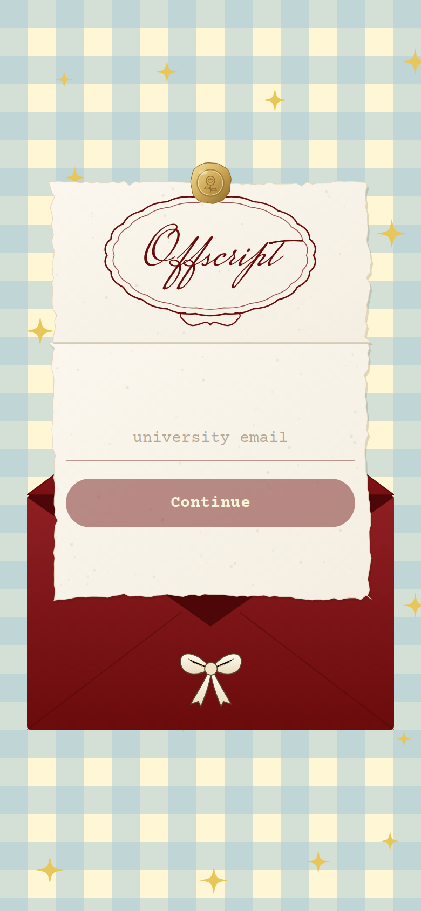
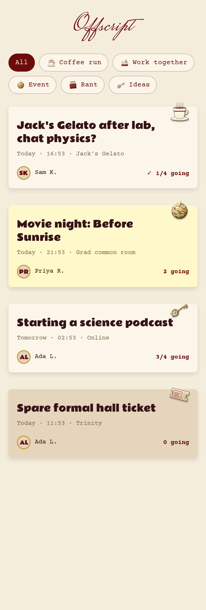
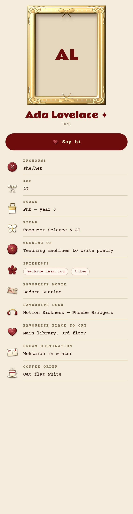

# Offscript ✦

*coffee runs, thesis rants & the people who get it*

Offscript is a meetup app for academics. It launches in **London and Cambridge**, but the app never names a city: anyone signing up from another university just sees *"we aren't there yet"*. Students, PhDs, postdocs and staff can:

- ☕ **Post coffee runs & study sessions**: "Heading to Waterstones to work on my thesis, anyone wanna co-work?", "Going to Jack's Gelato after lab, anyone want to chat physics?"
- 🎬 **Host events**: movie nights in the common room, socials, pub quizzes.
- 🎟️ **Share spare tickets**: "I have an extra formal hall ticket at Trinity on Thursday".
- 🧪 **Find study participants**: "Looking for 10 people for a 20-min user study".
- 🎤 **Find a conference buddy**: so nobody has to go alone.
- 💡 **Start things together**: podcasts, startups, reading groups.
- 🌧️ **Rant about dissertations**: with people who understand.
- ✨ **Get matched** with people near you who have a similar research focus (or a refreshingly different one).

Sign-up needs a **university email** (e.g. `@ucl.ac.uk`, `@cam.ac.uk`). New members add a portrait (shown in an ornate gold frame) and answer a few fun questions (favourite movie, favourite song, favourite place to cry at uni, dream holiday…). They **choose which answers to show**, and each answer appears next to its own vintage sticker: headphones for the song, a postcard for the dream destination, a ticket stub for the movie.

The landing page is a maroon envelope on a baby-blue gingham tablecloth: the flap opens, a torn-edged letter with a gold wax seal slides out, *Offscript* is typed onto it in calligraphy inside a scalloped frame, and its second fold opens to ask for your email ([frames](docs/screens/landing-animation.png)).

The look: maroon, butter yellow and baby blue, Brioche-style headings, typewriter text, and scrapbook stickers. Matches is a swipe deck, posts are pinned like scraps on a board, and joining a meetup stamps a wax seal.

| | | |
|---|---|---|
|  |  |  |

**Built with:** React Native + Expo (SDK 57) · Expo Router · Supabase (database, login, chat, photos) · RevenueCat (subscriptions).

## 👉 Start here

- **[docs/SETUP_GUIDE.md](docs/SETUP_GUIDE.md)**: everything from installing the tools to publishing on the App Store and Google Play, written for non-coders.
- **[docs/FREEMIUM_PLAN.md](docs/FREEMIUM_PLAN.md)**: what's free, what's in Plus (£4.99/month), and why.

## Quick commands

```bash
npm install          # first time only
npx expo start       # run the app (scan the QR code with Expo Go)
npm run typecheck    # check the code for mistakes
```
